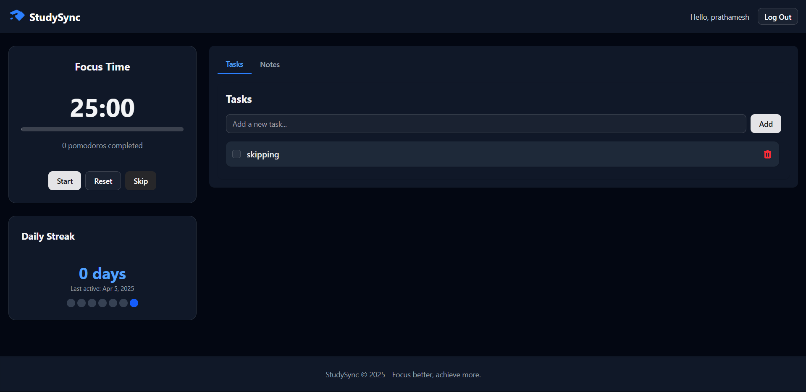

# StudySync

StudySync is a comprehensive student productivity application designed to help users manage tasks, take notes, and maintain focused study sessions using the Pomodoro technique.



## Features

- **Task Management**: Create, toggle, and delete tasks to track your progress
- **Notes System**: Organize your study notes with tags for easy retrieval
- **Pomodoro Timer**: Stay focused with built-in work/break sessions
- **Streak Tracking**: Maintain motivation with a daily usage streak counter
- **User Authentication**: Secure login and registration system
- **Responsive Design**: Works seamlessly on desktop and mobile devices
- **Dark/Light Mode**: Choose your preferred theme for comfortable studying

## Tech Stack

### Frontend
- React
- TypeScript
- Tailwind CSS
- shadcn/ui components
- React Router for navigation
- Axios for API requests

### Backend
- Node.js
- Express
- MongoDB with Mongoose
- JWT for authentication
- bcrypt for password hashing

## Installation

### Prerequisites
- Node.js (20+)
- MongoDB (local or Atlas)
- npm or yarn

### Setup Instructions

1. Clone the repository
```bash
cd studysync
```

2. Install dependencies
```bash

# Install client dependencies
cd client
pnpm install

# Install server dependencies
cd server
pnpm install
```

3. Environment Variables

Create a `.env` file in the server directory with the following variables:
```
NODE_ENV=development
PORT=5000
MONGODB_URI=mongodb://localhost:27017/studysync
JWT_SECRET=your_jwt_secret_here
```

4. Run the application in development mode
```bash
# Run both frontend and backend
pnpm run dev
```

5. Build for production
```bash
# Build the client
cd client
pnpm run build
```

## Usage Guide

### Registration and Login
- Create a new account or log in with existing credentials
- Your session will remain active until you log out

### Task Management
- Add new tasks using the input field
- Toggle task completion with the checkbox
- Delete tasks with the trash icon

### Note Taking
- Create notes with title, content, and tags
- Search notes by title or tags
- Edit notes by clicking on them

### Pomodoro Timer
- Start a 25-minute focus session
- Take a 5-minute break after each session
- Longer 15-minute breaks after every 4 sessions

### Streak Tracking
- Your usage streak is automatically tracked
- Visit daily to maintain your streak

## API Endpoints

### Authentication
- `POST /api/user/register` - Register a new user
- `POST /api/user/login` - Login user
- `GET /api/user` - Get user data

### Tasks
- `GET /api/tasks` - Get all tasks
- `POST /api/tasks` - Create a new task
- `PUT /api/tasks/:id` - Update a task
- `DELETE /api/tasks/:id` - Delete a task

### Notes
- `GET /api/notes` - Get all notes
- `GET /api/notes/:id` - Get a specific note
- `POST /api/notes` - Create a new note
- `PUT /api/notes/:id` - Update a note
- `DELETE /api/notes/:id` - Delete a note
- `GET /api/notes/tag/:tag` - Get notes by tag
- `GET /api/notes/search/:query` - Search notes

## Acknowledgements

- [React](https://reactjs.org/)
- [Node.js](https://nodejs.org/)
- [MongoDB](https://www.mongodb.com/)
- [Tailwind CSS](https://tailwindcss.com/)
- [shadcn/ui](https://ui.shadcn.com/)